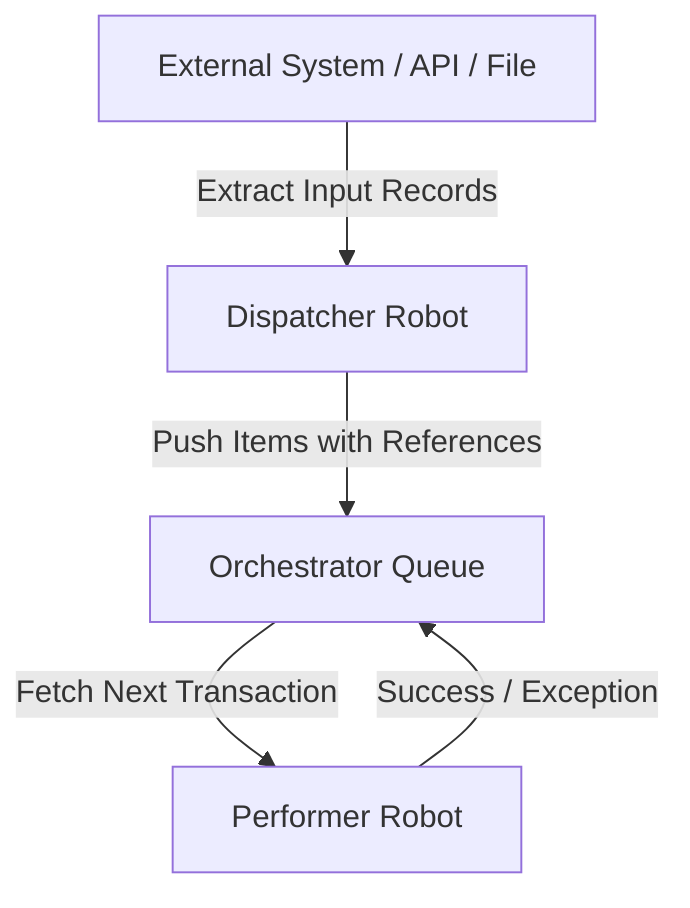
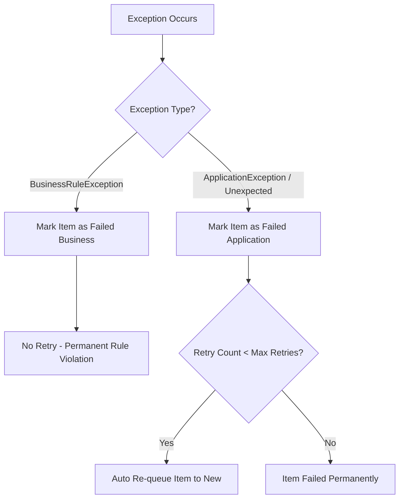

# Lattice RPA Core SDK (`rpa_core`)

The official Python Software Development Kit (SDK) and framework for building enterprise Robotic Process Automation (RPA) robots with **Lattice RPA Orchestrator**.

`rpa_core` standardizes robot execution lifecycle, abstracts Orchestrator REST APIs, manages encrypted credentials, provides automatic retry mechanisms, and separates automation logic into clean **Dispatcher** and **Performer** patterns.

---

## Table of Contents
1. [Architecture Overview](#architecture-overview)
2. [Installation](#installation)
3. [Environment Configuration](#environment-configuration)
4. [Working with Assets & Credentials](#working-with-assets--credentials)
5. [Developing a Dispatcher Robot (`BaseDispatcher`)](#developing-a-dispatcher-robot-basedispatcher)
6. [Developing a Performer Robot (`BasePerformer`)](#developing-a-performer-robot-baseperformer)
7. [Exception Handling Architecture](#exception-handling-architecture)
8. [Utilities & Resiliency Tools](#utilities--resiliency-tools)
9. [Docker & Execution Agent Guidelines](#docker--execution-agent-guidelines)

---

## Architecture Overview

Lattice RPA automations follow the industry-standard **Dispatcher-Performer Architecture**:



1. **Dispatcher Robot**: Responsible for gathering input dataset records (from files, APIs, database tables) and creating `QueueItem` transactions in Orchestrator Queues. Automatically handles deduplication via `reference`.
2. **Performer Robot**: Runs a resilient transaction loop to pull items (`SKIP LOCKED`) from the Queue, process them, and store output payloads or report exceptions.

---

## Installation

Add `rpa-core` to your robot's `requirements.txt`:

```text
rpa-core @ git+https://github.com/currentlib/lattice-rpa-core-sdk.git@main
```

Then install:

```bash
pip install -r requirements.txt
```

---

## Environment Configuration

When a robot is launched by the **Lattice Execution Agent**, the agent automatically injects the following environment variables:

| Environment Variable | Description | Example |
| :--- | :--- | :--- |
| `ORCHESTRATOR_URL` | Base URL of the Orchestrator API | `http://10.42.0.2:8000` |
| `JOB_TOKEN` | Ephemeral single-use authentication JWT | `eyJhbGciOiJIUzI1Ni...` |

`rpa_core.OrchestratorClient` reads these variables automatically on initialization.

---

## Working with Assets & Credentials

Assets allow you to store configurable settings, flags, thresholds, and **Fernet-encrypted Credentials** securely on the Orchestrator without hardcoding them in your code.

### Asset Retrieval Methods

Inside your `BaseDispatcher` or `BasePerformer` class, access assets using these type-safe methods:

```python
from rpa_core import BasePerformer

class InvoicePerformer(BasePerformer):
    QUEUE_NAME = "Invoices"

    def setup(self):
        # 1. Fetch encrypted Credential secret (API Key / Password)
        api_secret = self.get_credential("CRM_API_SECRET")

        # 2. Fetch Integer Asset with fallback default
        self.max_amount = self.get_asset_int("MaxThreshold", default=5000)

        # 3. Fetch Boolean Asset (parses 'true', '1', 'yes')
        self.use_sandbox = self.get_asset_bool("UseSandbox")

        # 4. Fetch Float Asset
        self.tax_rate = self.get_asset_float("TaxRate", default=0.15)

        # 5. Fetch JSON Config Asset
        self.config = self.get_asset_json("SystemConfig")

        # 6. Fetch Raw String Asset
        self.endpoint = self.get_asset("API_ENDPOINT")
```

---

## Developing a Dispatcher Robot (`BaseDispatcher`)

The `BaseDispatcher` framework handles setup, item pushing, deduplication logging, and execution summary metrics.

### Example Dispatcher: `dispatcher_main.py`

```python
from rpa_core import BaseDispatcher, load_csv

class InvoiceDispatcher(BaseDispatcher):
    QUEUE_NAME = "Invoices"

    def setup(self):
        self.log("Reading target input CSV file...")
        self.input_file = "invoices_batch.csv"

    def dispatch(self):
        # Load records from CSV or API
        records = load_csv(self.input_file)
        
        items_to_push = []
        for row in records:
            items_to_push.append({
                "reference": f"INV-{row['invoice_num']}",
                "data": {
                    "invoice_num": row["invoice_num"],
                    "vendor": row["vendor"],
                    "amount": float(row["amount"]),
                }
            })
            
        # Return list of items to bulk-push to Orchestrator Queue
        return items_to_push

    def cleanup(self):
        self.log("Dispatcher completed successfully.")

if __name__ == "__main__":
    dispatcher = InvoiceDispatcher()
    dispatcher.run()
```

---

## Developing a Performer Robot (`BasePerformer`)

The `BasePerformer` framework runs a resilient state machine loop pulling items from the Orchestrator Queue until no items remain.

### Example Performer: `main.py`

```python
from rpa_core import BasePerformer, BusinessRuleException

class InvoicePerformer(BasePerformer):
    QUEUE_NAME = "Invoices"

    def setup(self):
        self.log("Initializing browser session and fetching assets...")
        self.crm_key = self.get_credential("CRM_API_SECRET")
        self.max_amount = self.get_asset_int("MaxThreshold", default=5000)

    def process(self, item):
        invoice_num = item.data.get("invoice_num")
        amount = item.data.get("amount", 0)

        self.log(f"Processing invoice #{invoice_num} for ${amount}")

        # Business Rule Exception (Non-retryable)
        if amount > self.max_amount:
            raise BusinessRuleException(f"Invoice amount ${amount} exceeds maximum threshold ${self.max_amount}")

        # Perform automation processing logic...
        crm_id = f"CRM-{invoice_num}"

        # Return dict payload to automatically capture Output Data in Orchestrator
        return {
            "status": "APPROVED",
            "crm_id": crm_id,
            "processed_amount": amount
        }

    def cleanup(self):
        self.log("Cleaning up robot resources and closing sessions.")

if __name__ == "__main__":
    robot = InvoicePerformer()
    robot.run()
```

---

## Exception Handling Architecture

`rpa_core` categorizes exceptions to enforce proper queue retry behaviors:



### 1. `BusinessRuleException`
- **Definition**: Violation of a business policy (e.g., *Invalid ID format*, *Amount > $5,000 requiring manual approval*).
- **Behavior**: Item status is set to `Failed` with `Business` exception type. **Will NOT be retried**.

### 2. `ApplicationException`
- **Definition**: System, network, or application failures (e.g., *Database connection timeout*, *Web element not found*).
- **Behavior**: Item status is set to `Failed` with `Application` exception type. If `retry_count < queue.max_retries`, Orchestrator **automatically re-queues the item as New**.

```python
from rpa_core import BusinessRuleException, ApplicationException

# Example usage inside process(item):
if not email.endswith("@company.com"):
    raise BusinessRuleException("Domain not allowed for automated processing")

if not page.is_visible("#submit_btn"):
    raise ApplicationException("Submit button failed to load within timeout")
```

---

## Utilities & Resiliency Tools

### 1. Exponential Backoff Retry Decorator (`@retry`)

Use `@retry` to wrap unstable HTTP endpoints or browser interactions:

```python
from rpa_core import retry, ApplicationException

@retry(max_attempts=3, delay=2.0, backoff=2.0, exceptions=(ApplicationException,))
def submit_to_external_api(data):
    response = requests.post("https://api.external.com/submit", json=data)
    if response.status_code != 200:
        raise ApplicationException(f"External API error: {response.text}")
    return response.json()
```

### 2. File I/O Helpers

```python
from rpa_core import load_csv, save_csv, load_json, save_json

# CSV Operations
rows = load_csv("input.csv")
save_csv("output.csv", rows)

# JSON Operations
data = load_json("config.json")
save_json("output.json", data)
```

### 3. Secret Masking

```python
from rpa_core import mask_secret

raw_key = "sk_live_99283102391203"
masked = mask_secret(raw_key, visible_chars=4)
# Returns: "******************03"
```

---

## Docker & Execution Agent Guidelines

### Docker Container Structure (`Dockerfile`)

```dockerfile
FROM python:3.11-slim

RUN apt-get update && apt-get install -y --no-install-recommends \
    git \
    ca-certificates \
    && rm -rf /var/lib/apt/lists/*

WORKDIR /app

COPY requirements.txt .
RUN pip install --no-cache-dir -r requirements.txt

COPY main.py .

CMD ["python", "main.py"]
```

### Docker Compose (`docker-compose.yml`)

```yaml
services:
  robot:
    build:
      context: .
    environment:
      - JOB_TOKEN=${JOB_TOKEN}
      - ORCHESTRATOR_URL=${ORCHESTRATOR_URL}
```

---

## Local Debugging & Testing Guide

You can run and step-debug your robot code locally directly from your IDE (VS Code, PyCharm, or terminal) against Orchestrator without committing code to Git or creating Orchestrator jobs.

### Step 1: Generate Developer Token
1. Log into Orchestrator UI.
2. Click **Dev Tokens** in the topbar header.
3. Click **Generate Token** and copy your secret key (`lat_dev_...`).

### Step 2: Create Local `.env` File
In your local robot project directory, create a `.env` file (ensure `.env` is added to your `.gitignore`):

```env
ORCHESTRATOR_URL=http://localhost:8000
ORCHESTRATOR_TOKEN=lat_dev_a8f9328109231...
DEV_FOLDER_NAME=Default
```

### Step 3: Run & Debug Directly in IDE
Run `python main.py` or start F5 debug session in VS Code / PyCharm! `rpa_core` will automatically load your `.env`, connect via `ORCHESTRATOR_TOKEN`, resolve the target folder, and execute your automation cleanly.
